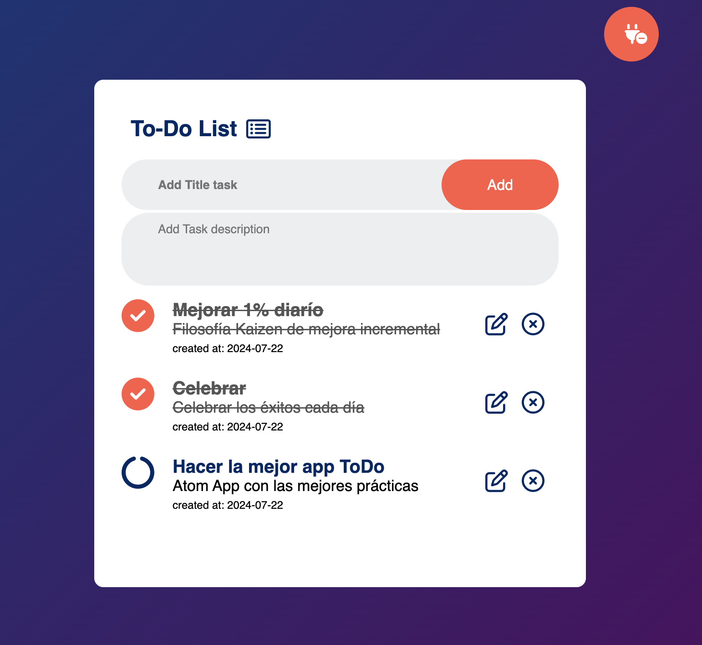

<!-- PROJECT LOGO -->
<br />
<p align="center">
  <a href="#">
        
  </a>

  <h1 align="center">
	Angular / Nestjs / Firebase 
  </h1>
  <h1 align="center">ToDo App List</h1>

  <p align="center">
    Renderiza dinamicamente un 
    <br /> ToDo App List 🖊️ (CRUD) 
    <br />
    🐞
    <a href="https://github.com/Saikilito/angular-nestjs-firebase-todo/issues">Reporta un Bug</a>
    
  </p>
</p>
    <p align="center">
    
    </p>

# El proyecto

El proyecto consiste en una aplicación de tareas (ToDo) sencilla que permite a los usuarios registrarse, crear nuevas tareas, marcar las tareas completadas, editarlas y eliminarlas según lo deseen.

**Basado en los siguientes requerimientos:**

- ✅ La aplicación consta de 2 páginas, la primera la cual funcionará
  como un inicio de sesión y la segunda página que será la principal, en
  la cual se mostrarán todas las tareas pendientes del usuario.

- ✅ Las tareas deben estar ordenadas por fecha de creación

- ✅ La página de inicio de sesión tiene un formulario donde solo se debe
  pedir el correo. Si el usuario existe, navega a la página principal, en
  caso contrario se deberá presentar un diálogo que confirme la
  creación del usuario. Si se crea el usuario debe navegar directamente
  a la página principal.

- ✅ Debe haber un formulario en la página principal que permite agregar
  nuevas tareas. Además de un botón que permite volver al inicio de
  sesión.

- ✅ Cada tarea debe mostrar su título, descripción, fecha de creación y
  estado de completado.

- ✅ El usuario debe poder marcar una tarea como completada o
  pendiente mediante una casilla de verificación.

- ✅ Debe existir una opción para editar y eliminar una tarea.

- ✅ La aplicación debe ser responsive y adaptarse a diferentes
  dispositivos.

- ✅ Desarrollar un API con lo siguiente:

  - Express y Typescript
  - Hosteado en cloudfunctions
  - Firebase Firestore para guardar los datos de las
    tareas

- ✅ El API deberá tener los siguientes endpoints:
  - **GET /tasks**: Obtener la lista de todas las tareas.
  - **POST /tasks**: Agregar una nueva tarea.
  - **PUT /tasks/{taskId}**: Actualizar los datos de una tarea existente.
  - **DELETE /tasks/{taskId}**: Eliminar una tarea existente.
  - **GET /users/{email}**: Busca el usuario si ha sido creado
  - **POST /users**: Agrega un nuevo usuario

# Características

### Estructura y organización del proyecto:

El objetivo de este proyecto, a pesar de ser sencillo en sus requisitos, es demostrar algunas de las habilidades y conocimientos del desarrollador. Por esta razón, la arquitectura utilizada está pensada para la implementación de una aplicación de tamaño mediano a grande, lo que permite que este proyecto pueda servir como plantilla o referencia para desarrollar aplicaciones que requieran escalabilidad en el tiempo.

Este proyecto (backend y frontend) fue diseñado con una estructura monorepositorio utilizando la tecnología de NX. El backend se basa en la _Clean Architecture_ centrada en el dominio, desacoplando las estructuras esenciales y las reglas de negocio del framework o infraestructura utilizada. Por su parte, el frontend opta por una estructura más sencilla pero igualmente poderosa, creando componentes bajo el patrón Container/Presentational.

En el diseño de la aplicación no se consideró el uso de una librería de UI para mantener el estándar nativo de Angular con SCSS. No obstante, se añadió ngx-toastr para mostrar notificaciones de errores a los usuarios de forma amigable.

Además, aunque no es requerido, el proyecto incluye una capa de seguridad utilizando Tokens **JWT** en la autenticación, los cuales se validan en cada solicitud. Esto garantiza que, si se desea extender a una aplicación más compleja en el futuro, esté preparada para hacerlo.

Ref:

- [NX Monorepository](https://nx.dev/)
- [Clean Architecture](https://blog.cleancoder.com/uncle-bob/2012/08/13/the-clean-architecture.html)
- [Container/Presentational Pattern](https://www.patterns.dev/react/presentational-container-pattern/)

# Construido con

- npm v10.7.0
- Angular v18
- Node v20.14.0
- Mac OS Sonoma 14.5
- Amor y pasión por el código

# Live Demo

## Prerrequisitos para correr en local

- Debe poseer una cuenta y proyecto activo en Firebase.

## Iniciar la app en local

Para iniciar esta app en local, por favor siga cuidadosamente los siguientes pasos:

0. Clone el repositorio: `git clone https://github.com/Saikilito/angular-nestjs-firebase-todo.git`
1. Navegue a la raíz del proyecto: `cd angular-nestjs-firebase-todo`
2. Inicie sesión en su cuenta de Firebase: `npx firebase login`
3. Inicie la configuración de Firebase desde la terminal: `npx firebase init`
4. Habilite la opción de Firebase para iniciar los emuladores, asegurándose de incluir al menos Firebase Functions y Firebase Firestore.
5. Instale todas las dependencias del proyecto: `npm ci`
6. Levante el backend con el comando: `npx nx serve gcf-api`
7. Una vez iniciado correctamente el backend, la terminal le proporcionará la dirección URL donde corren los emuladores de Firebase. Esta tendrá una forma similar a `http://127.0.0.1:3001/<firebase-project-name>/us-central1/api`. Guarde esta dirección ya que será vital para correr el proyecto.
8. Agregue variables de entorno:
   - En `apps/gcf-api/src/config` encontrará un archivo `secrets.template` el cual debe renombrar como `secrets.ts` y reemplazar por contenido válido las variables de entorno que ahí encontrará.
   - En `apps/web-app/src/config` encontrará un archivo `secrets.template` el cual debe renombrar como `secrets.ts` y reemplazar por contenido válido las variables de entorno que ahí encontrará. Tenga en cuenta que la URL del servidor puede cambiar dependiendo del nombre de su proyecto Firebase y la versión del emulador que esté utilizando. También asegúrese de agregar el sufijo `/v1` a la dirección del servidor, donde se encuentran trabajando todas las rutas del servidor.
9. Levante el frontend con el comando: `npx nx serve web-app`
10. Abra la app en [localhost:4200](http://localhost:4200) para ver la Angular ToDo App.

### Descripción de las variables de entorno:

Se refiere al secreto para firmar los tokens JWT:

```bash
ENV_JWT_SECRET =
```

Se refiere a la dirección URL sobre la que corren los emuladores de Firebase. Esta la provee la terminal una vez que inicie el servidor:

```bash
SERVER_URL =
```

**Nota:** Después de configurar el proyecto por primera vez, puede correr el proyecto en una única terminal con el comando npx nx run-many --target=serve --all.

**Nota:** Tenga en cuenta que la dirección del servidor debe incluir un prefijo `/v1`, quedando con una forma similar a `http://127.0.0.1:3001/<firebase-project-name>/us-central1/api/v1`

**Nota:** En el backend, en `apps/gcf-api/request`, encontrará archivos `*.http` que documentan los endpoints disponibles en la aplicación. Si tiene instalada la extensión "REST Client" en VSCode, puede ejecutar directamente los endpoints sin necesidad de salir del editor.
