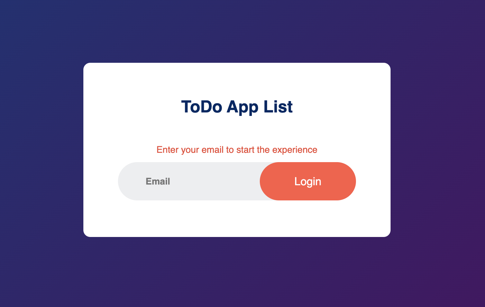

<!-- PROJECT LOGO -->
<br />
<p align="center">
  <a href="#">
        
  </a>

  <h1 align="center">
	Angular / Nestjs / Firebase 
  </h1>
  <h1 align="center">ToDo App List</h1>

  <p align="center">
    Renderiza dinamicamente un 
    <br /> ToDo App List 🖊️ (CRUD) 
    <br />
    🐞
    <a href="https://github.com/Saikilito/angular-nestjs-firebase-todo/issues">Reporta un Bug</a>
    
  </p>
</p>
    <p align="center">
    
    </p>

# El proyecto

El proyecto consiste en una aplicación de tareas (ToDo) sencilla que permite a los usuarios registrarse, crear nuevas tareas, marcar las tareas completadas, editarlas y eliminarlas según lo deseen.

**Basado en los siguientes requerimientos:**

- ✅ La aplicación consta de 2 páginas, la primera la cual funcionará
  como un inicio de sesión y la segunda página que será la principal, en
  la cual se mostrarán todas las tareas pendientes del usuario.

- Las tareas deben estar ordenadas por fecha de creación

- ✅ La página de inicio de sesión tiene un formulario donde solo se debe
  pedir el correo. Si el usuario existe, navega a la página principal, en
  caso contrario se deberá presentar un diálogo que confirme la
  creación del usuario. Si se crea el usuario debe navegar directamente
  a la página principal.

- ✅ Debe haber un formulario en la página principal que permite agregar
  nuevas tareas. Además de un botón que permite volver al inicio de
  sesión.

- ✅ Cada tarea debe mostrar su título, descripción, fecha de creación y
  estado de completado.

- ✅ El usuario debe poder marcar una tarea como completada o
  pendiente mediante una casilla de verificación.

- ✅ Debe existir una opción para editar y eliminar una tarea.

- La aplicación debe ser responsive y adaptarse a diferentes
  dispositivos.

- ✅ Desarrollar un API con lo siguiente:

  - Express y Typescript
  - Hosteado en cloudfunctions
  - Firebase Firestore para guardar los datos de las
    tareas

- ✅ El API deberá tener los siguientes endpoints:
  - **GET /tasks**: Obtener la lista de todas las tareas.
  - **POST /tasks**: Agregar una nueva tarea.
  - **PUT /tasks/{taskId}**: Actualizar los datos de una tarea existente.
  - **DELETE /tasks/{taskId}**: Eliminar una tarea existente.
  - **GET /users/{email}**: Busca el usuario si ha sido creado
  - **POST /users**: Agrega un nuevo usuario

# Características

### Estructura y organización del proyecto:

El objetivo de este proyecto, a pesar de ser sencillo en sus requisitos, es demostrar algunas de las habilidades y conocimientos del desarrollador. Por esta razón, la arquitectura utilizada está pensada para la implementación de una aplicación de tamaño mediano a grande, lo que permite que este proyecto pueda servir como plantilla o referencia para desarrollar aplicaciones que requieran escalabilidad en el tiempo.

Este proyecto (backend y frontend) fue diseñado con una estructura monorepositorio utilizando la tecnología de NX. El backend se basa en la _Clean Architecture_ centrada en el dominio, desacoplando las estructuras esenciales y las reglas de negocio del framework o infraestructura utilizada. Por su parte, el frontend opta por una estructura más sencilla pero igualmente poderosa, creando componentes bajo el patrón Container/Presentational.

En el diseño de la aplicación no se consideró el uso de una librería de UI para mantener el estándar nativo de Angular con SCSS. No obstante, se añadió ngx-toastr para mostrar notificaciones de errores a los usuarios de forma amigable.

Además, aunque no es requerido, el proyecto incluye una capa de seguridad utilizando Tokens **JWT** en la autenticación, los cuales se validan en cada solicitud. Esto garantiza que, si se desea extender a una aplicación más compleja en el futuro, esté preparada para hacerlo.

Ref:

- [NX Monorepository](https://nx.dev/)
- [Clean Architecture](https://blog.cleancoder.com/uncle-bob/2012/08/13/the-clean-architecture.html)
- [Container/Presentational Pattern](https://www.patterns.dev/react/presentational-container-pattern/)

# Construido con

- npm v10.7.0
- Angular v18
- Node v20.14.0
- Mac OS Sonoma 14.5
- Amor y pasión por el código

# Live Demo

## Prerequisitos para correr en local

- Ud. Debe poseer una cuenta activa en firebase

## Iniciar la app en local

Para iniciar esta app en local por favor siga cuidadosamente los siguiente pasos:

1. Ud. debe estar en la raiz del proyecto
2. Ud. debe iniciar sesion en su cuenta de firebase `npx firebase login`
3. Inicie la configuración de firebase `npx firebase init` desde la terminal
4. Ud. debe habilitar la opcion de firebase

2 - git clone

```bash
git clone https://github.com/Saikilito/smartcode-tickets.git
cd smartcode-tickets
```

3- Dentro de la carpeta `server` escribe una archivo `.env` con la información necesaria para conectarse a la base de datos, usa el archivo `.env.example` para guiarte

```bash
cd smartcode-tickets/server
```

```bash
USERNAME_DB =
PASSWORD_DB =
DB_NAME =
JWT_SECRET =
```

PD: La variable JWT_SECRET recibe un `string` que desees colocar, este se usará como firma para garantizar los hash que protegen las rutas.

4- instala y corre el servidor (DEV MODE)

```bash
yarn
yarn dev
```

5- instalar y corre el cliente

```bash
cd smartcode-tickets/client
yarn && yarn start
```

Abre el servidor en [http://localhost:3000/](http://localhost:3000/) Para ver el cliente.
Usa [http://localhost:4000/](http://localhost:4000/) para interactuar con el server

PD: Usa email: "admin@smartcode.com" y password: "123456" para logearte como administrador
